# Ice Resurfacer Solution - Mermaid Diagram

## Problem and Solution Flow

```mermaid
flowchart TD
    A["🧊 PROBLEM: Severely Crowned Ice Surface<br/>3-4 inches high in center"] --> B["📏 Assessment Phase<br/>Measure crown height<br/>Determine material to remove"]
    
    B --> C["🔧 SOLUTION: Progressive Multi-Pass Blade Cutting"]
    
    C --> D["⚡ PASS 1: AGGRESSIVE CUT<br/>Blade: -3 to -4mm<br/>Remove 60-70% of excess ice<br/>Focus on center high areas"]
    
    D --> E["🎯 PASS 2: MEDIUM CUT<br/>Blade: -2 to -2.5mm<br/>Refine profile<br/>Create smooth transitions"]
    
    E --> F["✨ PASS 3: FINE CUT<br/>Blade: -0.5 to -1mm<br/>Final surface preparation<br/>Ready for normal resurfacing"]
    
    F --> G["✅ FINAL RESULT<br/>Level ice surface<br/>Professional skating quality"]
    
    style A fill:#fecaca,stroke:#dc2626,stroke-width:3px
    style D fill:#fed7d7,stroke:#dc2626,stroke-width:2px
    style E fill:#fef3c7,stroke:#f59e0b,stroke-width:2px
    style F fill:#dcfce7,stroke:#16a34a,stroke-width:2px
    style G fill:#a7f3d0,stroke:#059669,stroke-width:3px
```

## Equipment and Blade Settings

```mermaid
graph LR
    subgraph "Ice Resurfacer Settings"
        A1["PASS 1<br/>🔴 AGGRESSIVE<br/>-3 to -4mm"] 
        A2["PASS 2<br/>🟡 MEDIUM<br/>-2 to -2.5mm"]
        A3["PASS 3<br/>🟢 FINE<br/>-0.5 to -1mm"]
    end
    
    subgraph "Ice Profile Transformation"
        B1["🏔️ Original Crown<br/>Severely peaked"]
        B2["📉 After Pass 1<br/>Major reduction"]
        B3["📊 After Pass 2<br/>Fine-tuned profile"]
        B4["📏 Final Result<br/>Level surface"]
    end
    
    A1 --> B2
    A2 --> B3
    A3 --> B4
    B1 --> A1
    
    style A1 fill:#fecaca,stroke:#dc2626
    style A2 fill:#fef3c7,stroke:#f59e0b
    style A3 fill:#dcfce7,stroke:#16a34a
    style B4 fill:#a7f3d0,stroke:#059669
```

## Safety and Quality Considerations

```mermaid
mindmap
  root((Ice Resurfacing<br/>Safety & Quality))
    Safety Considerations
      Blade Depth Limits
        Never exceed machine max
        Progressive adjustment
      Speed Control
        Slower for aggressive cuts
        Maintain control
      Ice Temperature
        Ideal: 22-26°F
        Optimal cutting conditions
    Quality Factors
      Overlap Patterns
        50% overlap between passes
        Avoid ridges
      Blade Condition
        Sharp blades essential
        Prevent ice tearing
      Surface Finish
        Professional skating quality
        Ready for normal maintenance
    Expected Results
      Ice Removal
        1.5-2 inches reduction
        Crown to level surface
      Equipment Efficiency
        Uses existing resurfacer
        No special tools needed
      Predictable Outcome
        Each pass has purpose
        Reduced over-cutting risk
```

## Step-by-Step Process Timeline

## Advantages Summary

